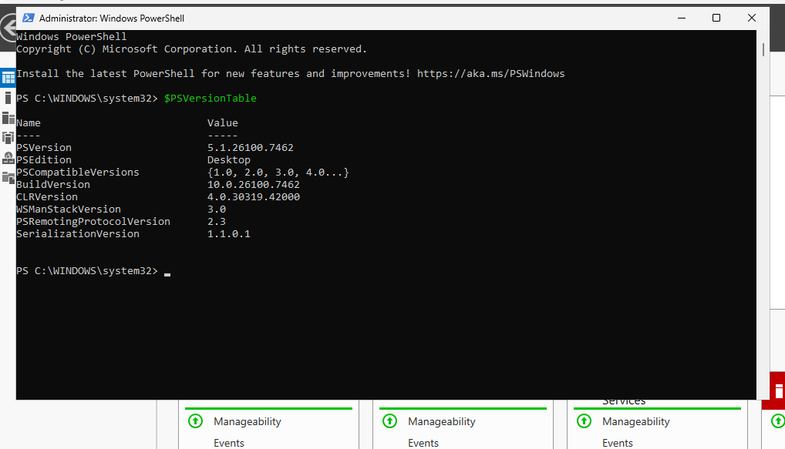
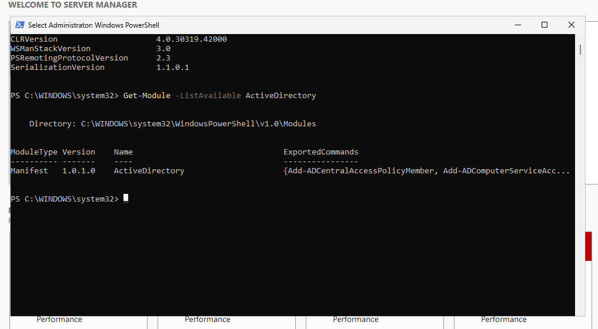
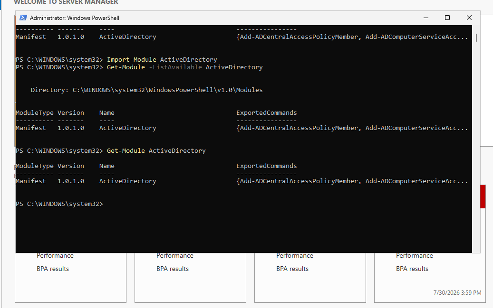
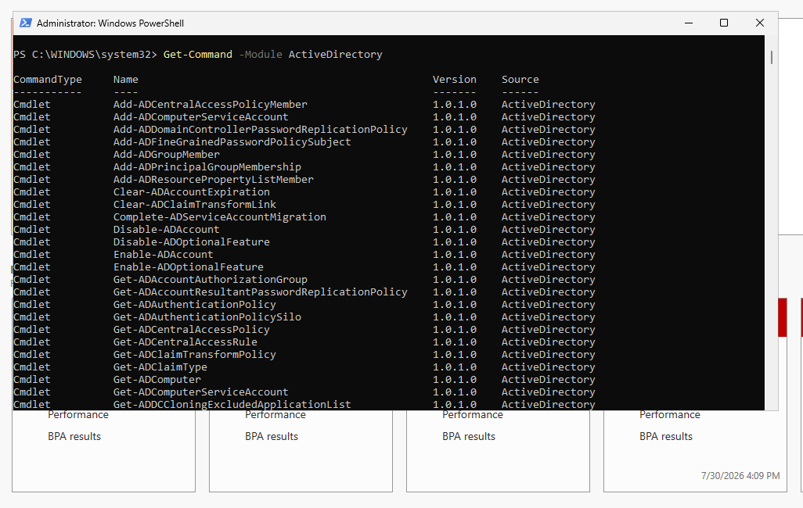

# PowerShell Environment Setup

## Purpose

Before using PowerShell to manage Active Directory, the PowerShell environment must be verified and configured correctly. This section documents the steps used to confirm that PowerShell is available and that the Active Directory PowerShell module can be accessed.

## Environment

| Component           | Configuration                    |
| ------------------- | -------------------------------- |
| Operating System    | Windows Server 2025              |
| Domain              | `harper.local`                   |
| Directory Service   | Active Directory Domain Services |
| Administration Tool | Windows PowerShell               |
| PowerShell Module   | ActiveDirectory                 |

## Opening PowerShell

PowerShell was opened on the Windows Server virtual machine with administrative privileges.

To open PowerShell as an administrator:

1. Open the Start menu.
2. Search for **Windows PowerShell**.
3. Select **Run as administrator**.
4. Approve the User Account Control prompt if it appears.

Running PowerShell as an administrator provides the permissions required for many system and Active Directory administrative tasks.

## Checking the PowerShell Version

The following command was used to view the installed PowerShell version:

```powershell
$PSVersionTable
```

This command displays information about the PowerShell environment, including the PowerShell version and operating system details.  

  

## Checking the Active Directory Module  

The following command was used to verify that the Active Directory PowerShell module was available:

```powershell
Get-Module -ListAvailable ActiveDirectory
```

The Active Directory module contains PowerShell cmdlets used to manage Active Directory objects, including users, groups, computers, and organizational units.  



## Importing the Active Directory Module

The following command was used to load the Active Directory module into the current PowerShell session:

```powershell
Import-Module ActiveDirectory
```

After importing the module, Active Directory cmdlets can be used during the current PowerShell session. 

  

## Verifying Active Directory Cmdlets

The following command was used to display Active Directory-related cmdlets:

```powershell
Get-Command -Module ActiveDirectory
```

This command lists the available PowerShell commands provided by the Active Directory module.



## Expected Results

The PowerShell environment is considered ready when:

* PowerShell opens successfully.
* PowerShell version information is displayed.
* The Active Directory module is available.
* The Active Directory module imports without errors.
* Active Directory cmdlets are available.

