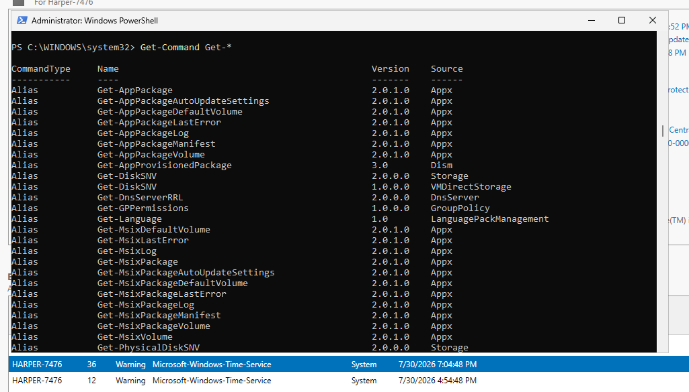
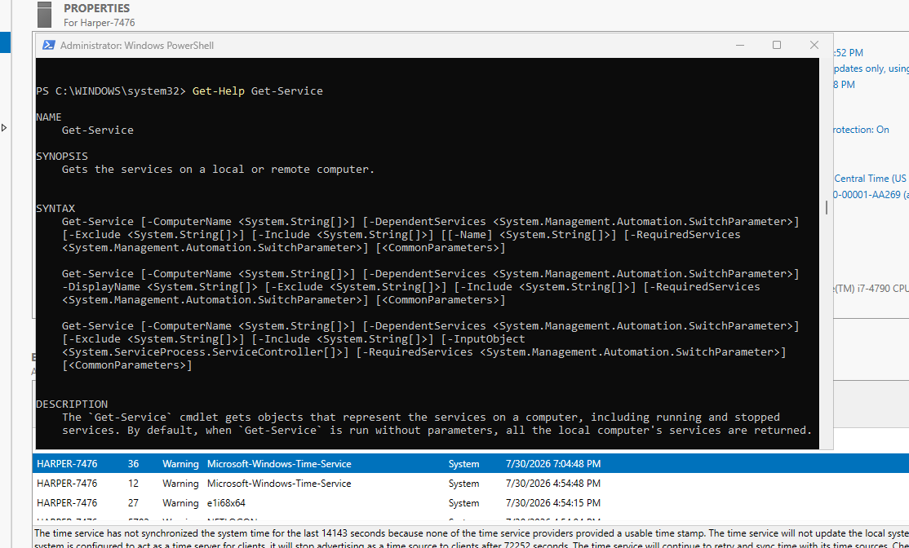
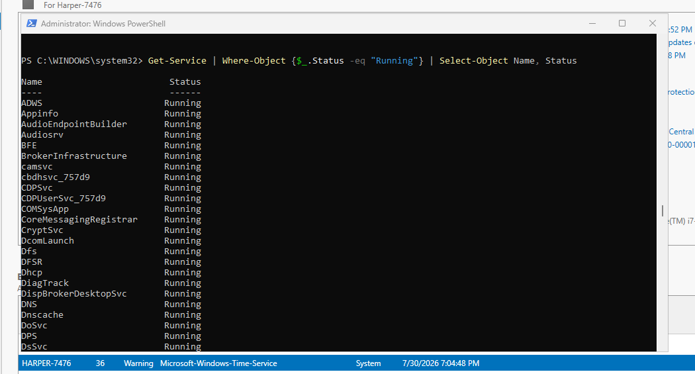
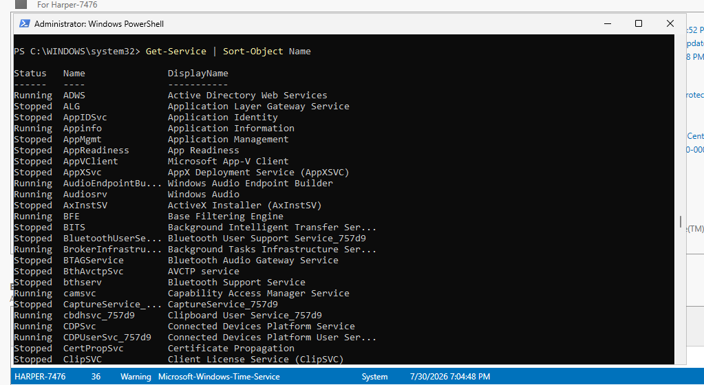

# PowerShell Basics

## Purpose

This section introduces the fundamentals of PowerShell administration. PowerShell is a command-line automation framework used by system administrators to manage Windows environments, automate tasks, and interact with services, applications, and Active Directory.

Understanding PowerShell fundamentals is important for Identity and Access Management (IAM) because administrators use PowerShell to manage users, groups, permissions, and identity workflows at scale.

## Cmdlet Structure

PowerShell commands are called cmdlets. Cmdlets follow a consistent naming convention:

```text
Verb-Noun
```

Examples:

```powershell
Get-Service
Get-Process
New-User
Set-Location
```

The verb describes the action being performed, while the noun identifies the object being managed.

Common verbs:

* Get - Retrieve information
* New - Create objects
* Set - Modify objects
* Remove - Delete objects
* Start - Start processes or services
* Stop - Stop processes or services

## Finding Commands

The `Get-Command` cmdlet is used to discover available PowerShell commands.

Example:

```powershell
Get-Command
```

Wildcards can be used to search for specific command patterns.

Example:

```powershell
Get-Command Get-*
```

This displays commands that begin with "Get".



## Using PowerShell Help

PowerShell includes built-in documentation through the `Get-Help` cmdlet.

Example:

```powershell
Get-Help Get-Service
```

Examples can be displayed with:

```powershell
Get-Help Get-Service -Examples
```

Using built-in help allows administrators to learn unfamiliar commands without memorizing every cmdlet.



## Parameters

Parameters modify how commands operate.

Example:

```powershell
Get-Service -Name W32Time
```

The `-Name` parameter limits the command output to a specific service.

PowerShell parameters follow this structure:

```text
Command -Parameter Value
```

## PowerShell Pipeline

The pipeline (`|`) passes the output of one command into another command.

Example:

```powershell
Get-Service | Format-List
```

The output from `Get-Service` is passed to `Format-List` for a different display format.

## Filtering with Where-Object

`Where-Object` filters objects based on conditions.

Example:

```powershell
Get-Service | Where-Object {$_.Status -eq "Running"}
```

This filters services and displays only those with a status of Running.

The `$_` symbol represents the current object being evaluated.

## Selecting Properties with Select-Object

`Select-Object` chooses which properties are displayed.

Example:

```powershell
Get-Service | Select-Object Name, Status
```

This displays only the Name and Status properties.

## Combining Commands

PowerShell commands can be chained together to create useful workflows.

Example:

```powershell
Get-Service | Where-Object {$_.Status -eq "Running"} | Select-Object Name, Status
```

This workflow:

1. Retrieves services
2. Filters running services
3. Displays only selected properties



## Sorting Results

`Sort-Object` organizes output based on a property.

Example:

```powershell
Get-Service | Sort-Object Name
```

This sorts services alphabetically by name.



## IAM Relevance

These PowerShell concepts are foundational for identity administration.

IAM administrators use these techniques to:

* Find user accounts
* Filter enabled or disabled accounts
* Generate access reports
* Review group membership
* Automate identity lifecycle tasks

Example:

```powershell
Get-ADUser -Filter * | Where-Object {$_.Enabled -eq $false}
```

This type of logic can be used to identify disabled accounts during identity reviews.

## Skills Demonstrated

* PowerShell command discovery
* PowerShell help system usage
* Command parameters
* Pipeline operations
* Object filtering
* Property selection
* Sorting data
* PowerShell fundamentals for IAM administration

