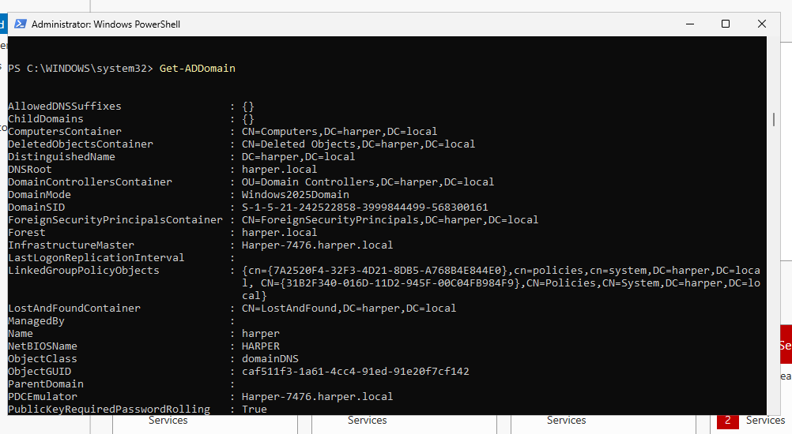
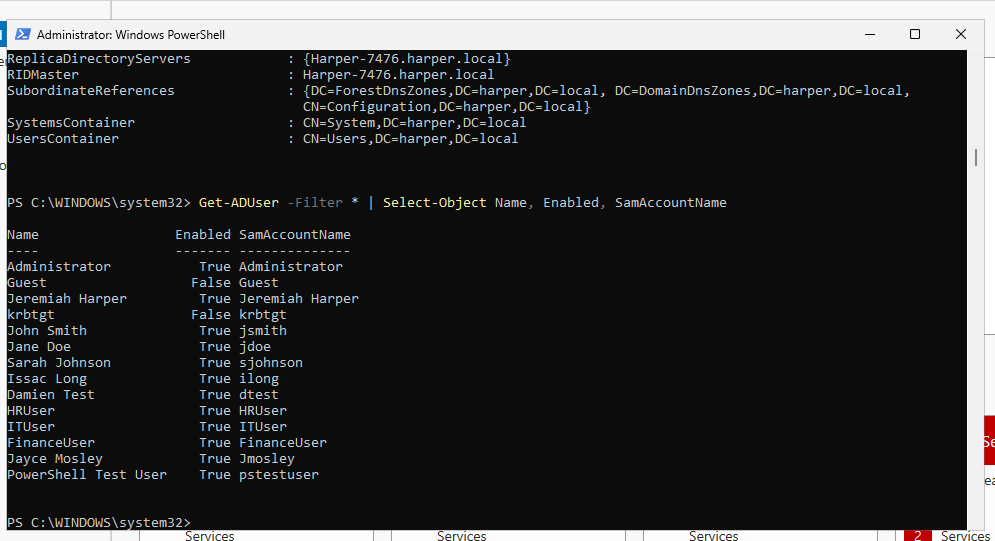
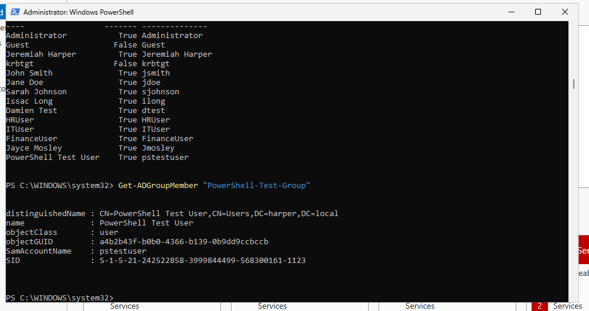
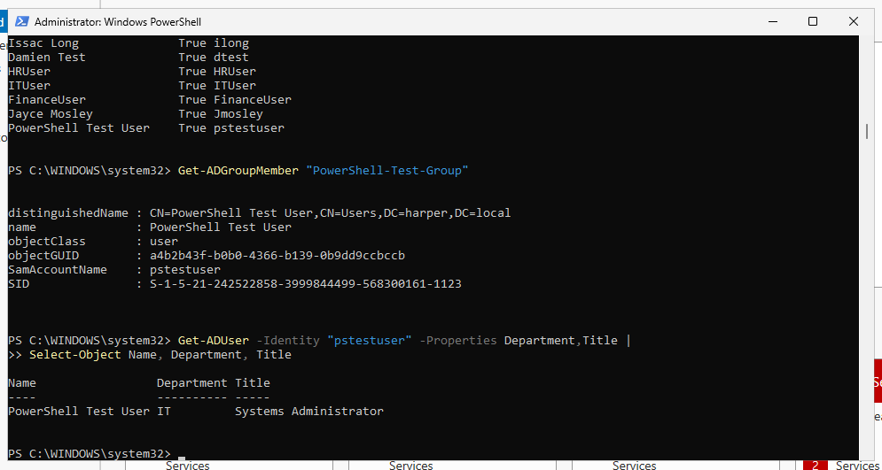
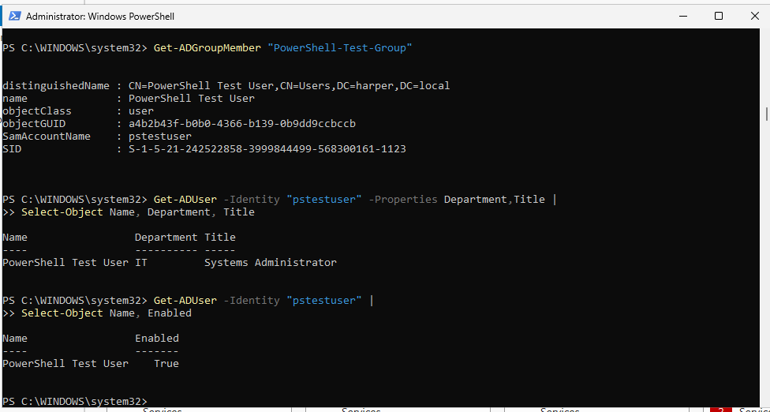

# Active Directory PowerShell Administration

## Purpose

This section demonstrates how PowerShell can be used to manage Active Directory identities. PowerShell provides administrators with the ability to query, create, modify, and manage users and groups efficiently.

These skills are foundational for Identity and Access Management (IAM) because they allow administrators to automate identity lifecycle tasks such as account creation, group assignment, attribute updates, and account status management.

## Environment

| Component        | Configuration                      |
| ---------------- | ---------------------------------- |
| Operating System | Windows Server 2025                |
| Domain           | `harper.local`                     |
| Tool             | Windows PowerShell                 |
| Module           | Active Directory PowerShell Module |

---

# Connecting to Active Directory

The Active Directory PowerShell module was used to verify connectivity to the domain.

Command:

```powershell
Get-ADDomain
```

This command retrieves information about the connected Active Directory domain.

The verification confirmed:

* Domain connectivity
* Forest information
* Domain configuration



---

# Querying Active Directory Users

The `Get-ADUser` cmdlet retrieves user objects from Active Directory.

Command:

```powershell
Get-ADUser -Filter *
```

The `-Filter *` parameter retrieves all user accounts.

To create a cleaner report, selected properties were displayed:

```powershell
Get-ADUser -Filter * | Select-Object Name, Enabled, SamAccountName
```

Displayed attributes:

* Name
* Account status
* Username



---

# Reviewing User Properties

Active Directory users contain many attributes that are useful for administration and auditing.

Additional properties can be retrieved using:

```powershell
Get-ADUser -Identity Administrator -Properties *
```

Specific attributes can be selected for reporting:

```powershell
Get-ADUser -Identity pstestuser -Properties Department,Title |
Select-Object Name, Department, Title
```

This allows administrators to review identity information without displaying unnecessary data.

---

# Active Directory Group Management

Groups are used to organize users and assign access permissions.

Groups were queried using:

```powershell
Get-ADGroup -Filter *
```

Group properties were reviewed using:

```powershell
Get-ADGroup -Filter * |
Select-Object Name, GroupScope, GroupCategory
```

The following information was reviewed:

* Group name
* Group scope
* Security group type

---

# Managing Group Membership

The `Get-ADGroupMember` cmdlet was used to verify group membership.

Command:

```powershell
Get-ADGroupMember "PowerShell-Test-Group"
```

This confirmed that the test user was successfully added to the security group.



---

# Creating Active Directory Users

A test account was created using `New-ADUser`.

Example:

```powershell
New-ADUser
```

The account creation process included:

* User identity information
* Username assignment
* Password configuration
* Account enablement

The created account was verified using:

```powershell
Get-ADUser -Identity "pstestuser"
```

---

# Modifying User Attributes

The `Set-ADUser` cmdlet was used to update identity attributes.

Example:

```powershell
Set-ADUser -Identity "pstestuser" `
-Department "IT" `
-Title "Systems Administrator"
```

The changes were verified by querying the user again.



---

# Account Lifecycle Management

IAM administrators must control account availability throughout the user lifecycle.

Accounts can be disabled using:

```powershell
Disable-ADAccount -Identity "pstestuser"
```

Accounts can be re-enabled using:

```powershell
Enable-ADAccount -Identity "pstestuser"
```

Verification:

```powershell
Get-ADUser -Identity "pstestuser" |
Select-Object Name, Enabled
```



---

# IAM Skills Demonstrated

This lab demonstrated:

* Active Directory PowerShell administration
* User account queries
* Group management
* Security group membership
* Identity creation
* Identity attribute management
* Account enable/disable operations
* PowerShell-based identity lifecycle management

---

# Summary

PowerShell provides administrators with a scalable method for managing Active Directory environments. These skills form the foundation for future IAM automation, including provisioning workflows, access reviews, and identity governance tasks.
